<div align="center">

<!-- ANIMATED BANNER SVG -->


<!-- TYPING ANIMATION via readme-typing-svg -->
<a href="https://git.io/typing-svg">
  
</a>

<br/>

<!-- SOCIAL BADGES -->
[](https://linkedin.com/in/oumaimaprofile)
[](mailto:souguir.oumaima@hotmail.com)
[](https://oumaima-souguir.vercel.app)


</div>

---

## `$ whoami`

```python
profile = {
    "name"       : "Oumaima Souguir",
    "role"       : "Software Engineer · ML Practitioner · Security-Aware Dev",
    "education"  : "Licence Informatique — CNAM Paris",
    "location"   : "Sousse, Tunisia",
    "languages"  : ["Arabic (native)", "French (professional)", "English C1", "German B2"],
    "interests"  : ["ML systems", "Secure APIs", "Edge AI", "MLOps"],
    "status"     : "Open to engineering opportunities 🟢",
}
```

---

## `$ ls projects/`

<table>
<tr>
<td width="50%" valign="top">

### 🤖 [`churn-prediction-ml`](https://github.com/OumaimaSouguir158/Prediction_Churn)

Telecom churn prediction pipeline — 3 models compared, cross-validation, SHAP explanations.

- **Dataset:** 7,000+ observations
- **Best model:** Random Forest · **AUC = 0.87**
- **Compared:** LR · RF · SVM with k-fold CV
- **Extra:** SHAP feature importance visualization


</td>
<td width="50%" valign="top">

### 🌐 [`library-management-system`](https://github.com/OumaimaSouguir158/University-Library)

Full-stack university library system — from UML design to Docker deployment.

- **Auth:** JWT · role-based (admin / librarian / student)
- **API:** REST with Swagger docs · Postman tested
- **DB:** PostgreSQL · relational schema from UML
- **Deploy:** Dockerized, one-command setup


</td>
</tr>
<tr>
<td width="50%" valign="top">

### 🔐 [`network-ids-python`](https://github.com/OumaimaSouguir158/Projet2_Detection_Anomalies_Reseau)

Snort IDS deployment + automated Python log analysis pipeline.

- **Detects:** port scans · SSH brute-force · SQLi patterns
- **Script:** Python parser for Snort alert logs
- **Tools:** Wireshark · Nmap · Hydra (lab environment)
- **Output:** structured audit report


</td>
<td width="50%" valign="top">

### 🚧 [`predictflow`](https://github.com/OumaimaSouguir158/predictflow) *(in progress)*

Production ML deployment pipeline — notebook → API → monitoring.

- **API:** FastAPI inference endpoint
- **Tracking:** MLflow experiment tracking
- **Deploy:** Docker · reproducible environment
- **Monitor:** data drift detection *(coming)*


</td>
</tr>
</table>

---

## `$ python3 skills.py`

<div align="center">

| Domain | Technologies |
|--------|-------------|
| **ML / AI** |        |
| **Security** |      |
| **Backend** |      |
| **Frontend** |    |
| **Mobile** |    |
| **DevOps** |    |

</div>

---

## `$ cat currently_building.log`

```
[2026] PredictFlow    → FastAPI + MLflow + Docker — churn model → production API
[2026] SentimentLens  → bilingual FR/EN NLP sentiment analysis (Streamlit demo)
[next] EdgeAI-ESP32   → TensorFlow Lite classification on microcontroller
[next] CI/CD pipeline → GitHub Actions + Jest automated testing on library system
```

---

## `$ git log --oneline experience`

```
7f3a2c1  Automation Developer @ Satisfy Insight (Nov–Dec 2025)
         └─ Python/Selenium pipelines · contract data automation · production

4e8b9d3  Product & Contract Coordinator @ BTT TN (Oct–Dec 2025)
         └─ 17 hotel contracts managed · >99% data reliability

2a1f0e8  Mobile Dev Intern @ Hacktoad, Paris 🇫🇷 (Jun 2023–Jan 2024, 7 months)
         └─ Kotlin/Android MVVM · OWASP mobile · AES encryption · Jira/Trello

9c3d5f1  Full-Stack Intern @ IT Gate, Sousse (Jun–Jul 2022)
         └─ Angular 13 · Node.js · MongoDB · OAuth 2.0 · RSA/AES
b4e1f9a  Application Security Intern @ Lab-IT, Sousse (Sep–Nov 2021)
         └─ JWT/OAuth 2.0 · NGINX/SSL config · pentest basics · 50%
```

---

## `$ cat metrics.json`

<div align="center">


</div>

<div align="center">


</div>

---

## `$ echo $LANGUAGES`

<div align="center">

| 🇹🇳 Arabic | 🇫🇷 Français | 🇬🇧 English | 🇩🇪 Deutsch |
|:-----------:|:------------:|:-----------:|:-----------:|
| Native | Professional | C1 | B2 |

</div>

---

<div align="center">

<!-- SNAKE ANIMATION — enable via GitHub Actions workflow below -->
<picture>
  <source media="(prefers-color-scheme: dark)"
    srcset="https://raw.githubusercontent.com/oumaima-souguir/oumaima-souguir/output/github-contribution-grid-snake-dark.svg"/>
  <source media="(prefers-color-scheme: light)"
    srcset="https://raw.githubusercontent.com/oumaima-souguir/oumaima-souguir/output/github-contribution-grid-snake.svg"/>
  
</picture>

<br/>
<br/>

<sub>
  <code>Sousse, Tunisia</code>
  &nbsp;·&nbsp;
  <code>Open to Software Engineering · AI/ML · Security roles</code>
  &nbsp;·&nbsp;
  <a href="https://linkedin.com/in/oumaimaprofile">LinkedIn</a>
  &nbsp;·&nbsp;
  <a href="mailto:souguir.oumaima@hotmail.com">Email</a>
</sub>

</div>
